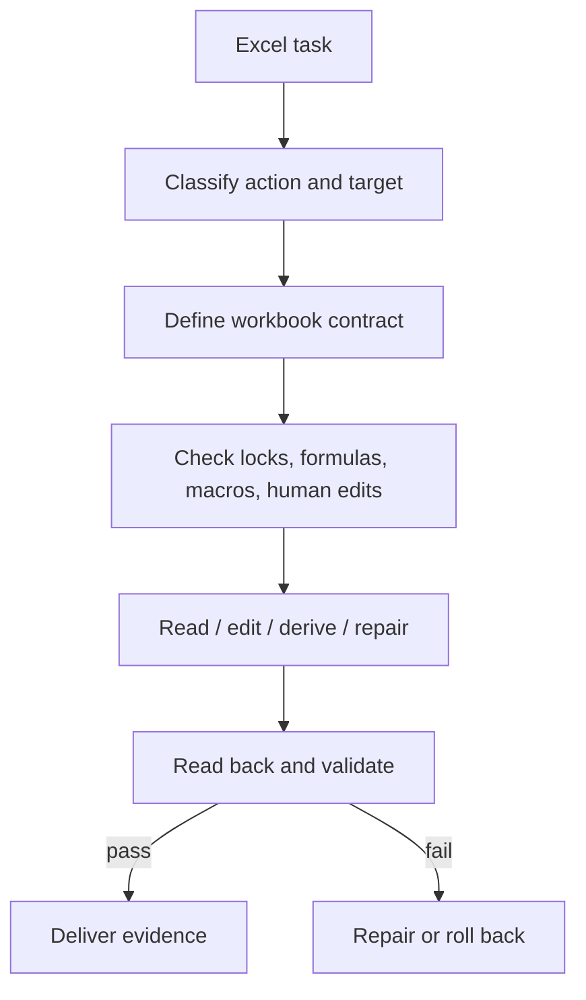

<!-- Language switch -->
**English** | [中文](./README.zh.md)

# excel-collab

**Make Excel work safe when the workbook is data, logic, output, and review surface at the same time.**

Excel automation fails quietly. A script can write the right-looking cells while breaking formulas, dropping macros, trusting stale cached values, or overwriting a human edit. `excel-collab` turns every Excel task into a contract before the file is touched.

Use it when an agent must inspect, modify, compare, repair, or explain `.xlsx`, `.xlsm`, or workbook-derived data.



## The Contract

Before writing, identify:

- the active workbook and active sheet;
- whether the task is read-only, edit, compare, generate, repair, or explain;
- the exact range or table being touched;
- whether formulas, formats, macros, validations, comments, or cached values matter;
- whether the workbook may be open or edited by a human;
- how the result will be validated after the write.

No write is complete until the workbook is read back or otherwise verified.

## What It Protects

| Risk | Protection |
| --- | --- |
| Wrong workbook or sheet | Explicit active-workbook contract |
| Formula loss | Formula-aware reads and post-write checks |
| Macro loss | `.xlsm` preservation and no blind conversion |
| Stale values | Formula/cache checks when values matter |
| User edits | Lock/open-file checks and scoped diffs |
| Silent write failure | Readback validation before delivery |

## Quick Start

```text
Use excel-collab for this workbook. Identify the active workbook and sheet, classify the task, preserve formulas/macros where relevant, and validate by readback before delivering.
```

## When Not To Use It

Do not use this skill for plain CSV analysis, simple tabular reasoning with no workbook fidelity requirement, or tasks where Excel is not the source, output, or review surface.

## License

MIT.
