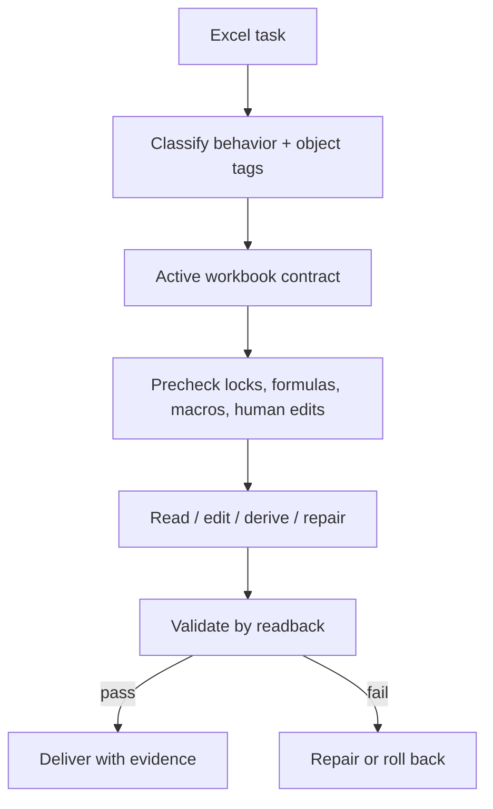

# excel-collab

**Safety rules for Excel work where workbooks are data, logic, output, and review surface at once.**

Excel work fails quietly because a workbook is rarely just a file. It may be the
source data, the generated output, the review surface, the current state, and a
human-edited artifact all at the same time. A script can produce the right shape
while overwriting formulas, dropping macros, trusting stale caches, or erasing
the user's manual edits.

`excel-collab` is a skill for reading, editing, validating, and explaining Excel
workbooks in human-AI collaboration. It turns each Excel task into an active
workbook contract, chooses the safest implementation path, and requires
readback instead of trusting that a write succeeded.



> **Design stance:** Excel is a review and delivery surface unless the user
> explicitly makes it the state root. Every write needs a contract and a
> verification path.

<details>
<summary>Table of contents</summary>

- [The problem](#the-problem)
- [Why this exists](#why-this-exists)
- [How it works](#how-it-works)
- [Quick start](#quick-start)
- [Core concepts](#core-concepts)
- [Implementation choices](#implementation-choices)
- [When to use it - and when not to](#when-to-use-it---and-when-not-to)

</details>

---

## The problem

Workbook edits are risky because the visible grid hides many dependencies:

- formulas and cached values can disagree;
- macros and VBA parts can be dropped by the wrong tool;
- hidden, filtered, merged, or protected cells can hide the true target;
- tables, names, charts, pivots, and formulas can depend on nearby ranges;
- a workbook can be open and locked by Excel;
- human edits can be overwritten by a generated update;
- non-ASCII paths and Windows shell behavior can break automation.

`excel-collab` makes those risks explicit before choosing how to read or write.

## Why this exists

The question is not simply:

> *Can we edit this workbook?*

The safer question is:

> *What role is this workbook playing, what exact surface may change, and how
> will we prove the result without damaging hidden workbook intent?*

That is why the skill starts with tags and an active workbook contract instead
of jumping directly into a script.

## How it works

Every task starts with two internal classifications:

1. **Behavior tags** such as `read`, `remove`, `add`, `overwrite`, `derive`,
   `style`, `calculate`, `repair`, or `toolize`.
2. **Object tags** such as `local`, `xlsx`, `xlsm`, `source`, `generated`,
   `state`, `formulas`, `macros`, `locked`, `non-ascii`, or `human-edited`.

Those tags choose the relevant safety rules:

- unfamiliar workbook: inspect first;
- formulas: distinguish formulas from cached values;
- overwrite: require an overwrite policy and sampled verification;
- calculate: use Excel's calculation engine when required;
- repair: inspect package or XML invariants before broad rewrites;
- toolize: build deterministic helpers for repeated workbook work.

## Quick start

Use the skill for workbook work that has meaningful state, formatting, formulas,
or user edits:

```text
Use excel-collab for this workbook. Identify the active workbook/sheet/range,
protect formulas and human edits, choose the safest implementation path, and
validate the result by readback.
```

Expected workflow:

- define the active workbook contract;
- inspect workbook structure and risk flags;
- choose `openpyxl`, OOXML, Excel COM, CSV tooling, or another path based on the
  tags;
- write only inside the declared target surface;
- validate by readback, sampled cells, workbook structure checks, or rendered
  review where layout matters.

## Core concepts

| Concept | Meaning |
| --- | --- |
| Active workbook contract | The exact workbook, sheet, range, role, and allowed edit surface |
| Behavior tags | The action type that controls workflow and validation |
| Object tags | Workbook conditions that change risk or implementation |
| Formula-vs-value handling | Whether formulas, cached values, or recalculation are authoritative |
| Human-edit protection | Rules that prevent generated updates from erasing manual work |
| Readback validation | Proof from the workbook after the write, not from script intent |

## Implementation choices

| Path | Use it when |
| --- | --- |
| `openpyxl` | Structured `.xlsx` edits where formulas/macros/calc engine are not the authority |
| OOXML package edits | Narrow repair or preservation-sensitive changes |
| Excel COM | Calculation, macros, pivots, or Excel-native refresh are required |
| CSV/TSV tools | The workbook-derived grid text is the real artifact |
| Deterministic helper | The same workbook operation will recur and needs repeatable validation |

## When to use it - and when not to

**Use `excel-collab` when you are thinking:**

- "This workbook has formulas, formatting, or user edits I must not damage."
- "I need to compare or audit workbook changes."
- "The write must be proven by reading the workbook back."
- "This Excel task should become a deterministic helper."

**Do not use it** for trivial CSV text manipulation, one-off plain-table
questions, or cases where the workbook is not actually part of the task.
