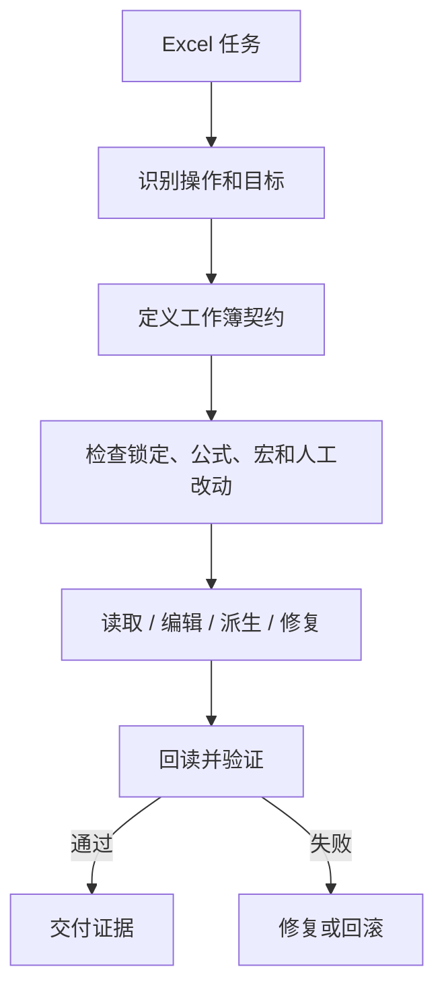

<!-- Language switch -->
[English](./README.md) | **中文**

# excel-collab

**当 Excel 同时是数据、逻辑、输出和审阅表面时，让操作变得可控。**

Excel 自动化很容易静默失败。脚本可能写出了看似正确的单元格，却破坏公式、丢掉宏、相信过期缓存，或覆盖人工改动。`excel-collab` 要求在碰文件之前，先把每个 Excel 任务变成明确契约。

当 Agent 需要检查、修改、比较、修复或解释 `.xlsx`、`.xlsm`，或由工作簿导出的数据时，使用它。



## 契约内容

写入前必须明确：

- 当前工作簿和当前 sheet；
- 任务是只读、编辑、比较、生成、修复，还是解释；
- 具体触碰的 range 或 table；
- 公式、格式、宏、数据验证、批注或缓存值是否重要；
- 工作簿是否可能被人打开或编辑；
- 写入后如何验证结果。

没有回读或等价验证，就不算完成写入。

## 它防什么

| 风险 | 防护方式 |
| --- | --- |
| 改错工作簿或 sheet | 明确 active workbook contract |
| 公式丢失 | 公式感知读取和写后检查 |
| 宏丢失 | 保留 `.xlsm`，避免盲目转换 |
| 值过期 | 需要时检查公式和缓存 |
| 覆盖人工改动 | 锁定/打开状态检查和范围化 diff |
| 静默写入失败 | 交付前回读验证 |

## 快速开始

```text
Use excel-collab for this workbook. Identify the active workbook and sheet, classify the task, preserve formulas/macros where relevant, and validate by readback before delivering.
```

## 何时别用

普通 CSV 分析、没有工作簿保真要求的表格推理，或 Excel 不是来源、输出、审阅表面的任务，不需要使用它。

## 许可证

MIT。
