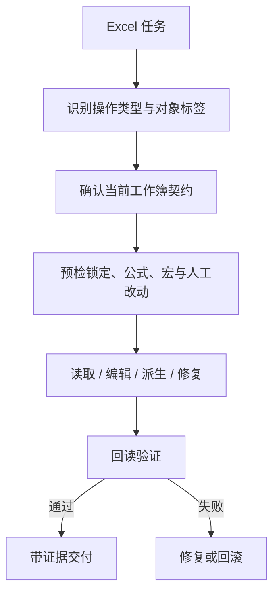

<!-- Language switch -->
[English](./README.md) | **中文**

# excel-collab

**用于 Excel 协作的安全规则:当 workbook 同时是数据、逻辑、输出和审阅表面时。**

Excel 工作会安静地失败,因为 workbook 很少只是一个文件。它可能同时是源数据、生成输出、
审阅表面、当前状态和人工编辑产物。脚本可以生成正确形状,却覆盖公式、丢掉宏、信任过期
缓存,或擦掉用户手工改动。

`excel-collab` 用于在人机协作中读取、编辑、验证和解释 Excel workbook。它把每个 Excel
任务转成 active workbook contract,选择最安全的实现路径,并要求 readback 验证,而不是
相信"脚本写了就成功"。



> **设计立场:** 除非用户明确把 Excel 作为状态根,否则 Excel 默认是审阅和交付表面。
> 每一次写入都需要契约和验证路径。

<details>
<summary>目录</summary>

- [问题](#问题)
- [为什么有它](#为什么有它)
- [它怎么工作](#它怎么工作)
- [快速开始](#快速开始)
- [核心概念](#核心概念)
- [实现选择](#实现选择)
- [何时用、何时别用](#何时用何时别用)
- [许可证](#许可证)

</details>

---

## 问题

workbook 编辑有风险,因为可见网格隐藏了很多依赖:

- 公式和缓存值可能不一致;
- 错误工具会丢掉宏和 VBA parts;
- hidden、filtered、merged 或 protected cells 会隐藏真实目标;
- tables、names、charts、pivots 和 formulas 可能依赖邻近范围;
- workbook 可能正被 Excel 打开并锁定;
- 人工编辑可能被生成式更新覆盖;
- 非 ASCII 路径和 Windows shell 行为可能破坏自动化。

`excel-collab` 在选择如何读写前,先把这些风险显式化。

## 为什么有它

问题不只是:

> *我们能不能编辑这个 workbook?*

更安全的问题是:

> *这个 workbook 扮演什么角色,哪个表面允许变化,以及我们如何证明结果没有破坏隐藏的
> workbook 意图?*

所以这个 skill 先做 tag 和 active workbook contract,而不是直接写脚本。

## 它怎么工作

每个任务先做两类内部分类:

1. **Behavior tags**,如 `read`、`remove`、`add`、`overwrite`、`derive`、`style`、
   `calculate`、`repair` 或 `toolize`。
2. **Object tags**,如 `local`、`xlsx`、`xlsm`、`source`、`generated`、`state`、
   `formulas`、`macros`、`locked`、`non-ascii` 或 `human-edited`。

这些 tag 选择相关安全规则:

- 陌生 workbook:先 inspect;
- formulas:区分 formula 和 cached value;
- overwrite:需要覆盖策略和 sampled verification;
- calculate:需要时使用 Excel 计算引擎;
- repair:大范围重写前先检查 package 或 XML invariant;
- toolize:为重复 workbook 操作构建确定性 helper。

## 快速开始

当 workbook 有有意义的状态、格式、公式或人工编辑时使用:

```text
Use excel-collab for this workbook. Identify the active workbook/sheet/range,
protect formulas and human edits, choose the safest implementation path, and
validate the result by readback.
```

预期工作流:

- 定义 active workbook contract;
- 检查 workbook 结构和风险标记;
- 根据 tags 选择 `openpyxl`、OOXML、Excel COM、CSV tooling 或其他路径;
- 只在声明的目标表面内写入;
- 通过 readback、sampled cells、workbook structure checks 或必要时的渲染审阅验证。

## 核心概念

| 概念 | 含义 |
| --- | --- |
| Active workbook contract | 精确 workbook、sheet、range、角色和允许编辑表面 |
| Behavior tags | 控制工作流和验证方式的动作类型 |
| Object tags | 改变风险或实现路径的 workbook 条件 |
| Formula-vs-value handling | formula、cached value 或 recalculation 谁是权威 |
| Human-edit protection | 防止生成式更新擦掉人工工作的规则 |
| Readback validation | 写入后从 workbook 本身拿证据,不是相信脚本意图 |

## 实现选择

| 路径 | 何时使用 |
| --- | --- |
| `openpyxl` | 结构化 `.xlsx` 编辑,且公式/宏/计算引擎不是权威 |
| OOXML package edits | 窄修复或 preservation-sensitive change |
| Excel COM | 需要计算、宏、pivot 或 Excel-native refresh |
| CSV/TSV tools | workbook-derived grid text 才是真正产物 |
| Deterministic helper | 同一 workbook 操作会重复,需要可复验 |

## 何时用、何时别用

**当你在想这些时,用 `excel-collab`:**

- "这个 workbook 有公式、格式或人工编辑,不能弄坏。"
- "我需要比较或审计 workbook 变化。"
- "写入必须通过读回 workbook 来证明。"
- "这个 Excel 任务应该工具化成确定性 helper。"

**不要用它** 做琐碎 CSV 文本处理、一次性纯表格问答,或 workbook 并不真正参与任务的场景。

## 许可证

MIT。
